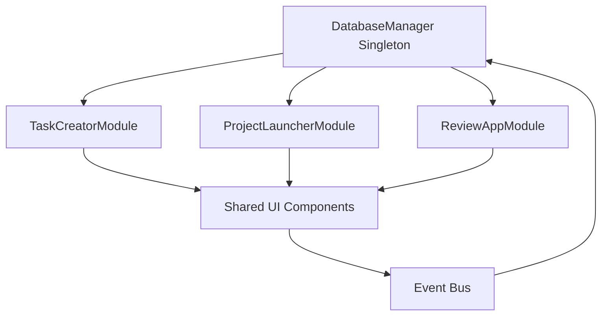

# Design Document

## Overview

The Montu Super App consolidation transforms the existing three-application ecosystem into a unified desktop application with centralized data management. The design leverages a tabbed interface architecture with shared components and a singleton database pattern to ensure data consistency and optimal performance.

## Architecture

### Application Structure
```
MontuSuperApp/
├── main_window.py          # Central application window
├── core/
│   ├── database_manager.py # Singleton database instance
│   ├── workspace_manager.py # Layout and state persistence
│   └── navigation_manager.py # Tab/panel coordination
├── modules/
│   ├── task_creator/       # Task creation functionality
│   ├── project_launcher/   # Project management
│   └── review_app/         # Media review
└── shared/
    ├── components/         # Reusable UI components
    ├── models/            # Data models
    └── utils/             # Common utilities
```

### Database Architecture
- **Singleton Pattern**: Single JSONDatabase instance shared across all modules
- **Event-Driven Updates**: Real-time synchronization between UI components
- **Connection Pooling**: Optimized database access patterns
- **Data Validation**: Centralized validation layer

## Components and Interfaces

### Core Components

#### 1. MainWindow (QMainWindow)
- **Purpose**: Central application container with tabbed interface
- **Key Features**: 
  - QTabWidget for module navigation
  - Shared toolbar and status bar
  - Workspace state management
- **Interface**: Provides module registration and communication APIs

#### 2. DatabaseManager (Singleton)
- **Purpose**: Centralized data access layer
- **Key Features**:
  - Single JSONDatabase instance
  - Connection lifecycle management
  - Event emission for data changes
- **Interface**: Standard CRUD operations with change notifications

#### 3. WorkspaceManager
- **Purpose**: Layout persistence and restoration
- **Key Features**:
  - QSettings integration for state storage
  - Panel arrangement saving/loading
  - Project-specific workspace configurations
- **Interface**: Save/restore workspace state methods#### 4
. NavigationManager
- **Purpose**: Coordinate between different functional modules
- **Key Features**:
  - Context preservation during navigation
  - Breadcrumb management
  - Inter-module communication
- **Interface**: Navigation events and context sharing

### Module Interfaces

#### TaskCreatorModule
- **Integration**: Embedded as tab in main window
- **Data Access**: Uses shared DatabaseManager instance
- **UI Components**: Reuses shared filter/search widgets
- **Communication**: Emits task creation events to other modules

#### ProjectLauncherModule  
- **Integration**: Primary tab with project selection
- **Data Access**: Shared database with real-time updates
- **UI Components**: Shared task list and version management widgets
- **Communication**: Broadcasts project/task selection events

#### ReviewAppModule
- **Integration**: Media review tab with player integration
- **Data Access**: Shared media records database
- **UI Components**: Shared annotation and approval widgets
- **Communication**: Emits approval status changes

## Data Models

### Centralized Data Flow


### Event System
- **DataChanged Events**: Notify all modules of data updates
- **NavigationEvents**: Handle context switching
- **WorkspaceEvents**: Manage layout changes
- **ValidationEvents**: Handle data integrity checks

## Error Handling

### Database Error Recovery
- **Connection Failures**: Automatic retry with exponential backoff
- **Data Corruption**: Backup restoration with user notification
- **Concurrent Access**: Queue-based operation serialization
- **Migration Errors**: Rollback capability with detailed logging

### UI Error Handling
- **Module Load Failures**: Graceful degradation with error tabs
- **Component Errors**: Isolated error boundaries per module
- **Navigation Errors**: Fallback to default workspace state
- **Data Validation**: Real-time validation with user feedback

## Testing Strategy

### Unit Testing
- **DatabaseManager**: Singleton behavior and data consistency
- **WorkspaceManager**: State persistence and restoration
- **NavigationManager**: Context preservation and event handling
- **Module Integration**: Interface compliance and communication

### Integration Testing
- **Cross-Module Communication**: Event propagation and handling
- **Database Synchronization**: Real-time updates across modules
- **Workspace Persistence**: Layout saving and restoration
- **Legacy Compatibility**: Migration from separate applications

### Performance Testing
- **Large Dataset Handling**: 500+ tasks with responsive UI
- **Memory Usage**: Single application vs. three separate apps
- **Database Performance**: Query optimization and caching
- **UI Responsiveness**: Tab switching and module loading times